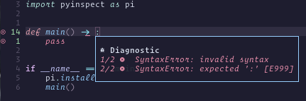
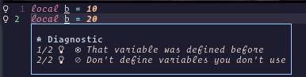

# A Full Neovim IDE

## I love speed, I love plugins, Speed implies Plugins

### /ᐠ.ꞈ.ᐟ\

This config is optimised with impatient, and the power of packer lazy loading, included with a unique syntax way to
highlight syntaxes .

## Setup

Probably one of the few neovim configs out there with a startup of <=1.8, loaded with impatient, and packers lazy
loading, About 200 plugins

```
-------------------------------------------------------------------------------
Language                     files          blank        comment           code
-------------------------------------------------------------------------------
Lua                             69           1234           1425           8220
vim script                      25            201            316            969
Markdown                         2             56              0            205
Scheme                           2              7              0             46
TOML                             3             10              0             40
Bourne Shell                     1              5              0             32
Python                           1              5              7              9
C                                1              1              0              2
-------------------------------------------------------------------------------
SUM:                           104           1519           1748           9523
-------------------------------------------------------------------------------
```

Start Up

```
Warmup #1
Warmup #2
No config : 015.695
With config : 029.731
Opening init.lua : 073.529
Opening Python file : 040.067
Opening C File : 034.394
Opening norg File : 110.658
```

### What does <= 1.8 Mean ?

No config presents how fast your pc is, in my case i have a rather fast pc : such that my start up time with no config
is 015 : once a config is added it is 0.29

```
029.731/015.695
1.8942975469894872
```

This is how fast the config should start up, for your pc 1.8 ish times

If you want to add plugins, please add them in the users folder

lua/modules/users/plugins

### Tree

```
├── core
│   ├── event.lua
│   ├── global.lua
│   ├── helper.lua
│   ├── init.lua
│   ├── lazy.lua
│   ├── mapping.lua
│   ├── options.lua
│   ├── pack.lua
│   └── timer.lua
├── internal
│   ├── bufonly.lua
│   ├── fsevent.lua
│   └── quickrun.lua
├── keymap
│   ├── bind.lua
│   ├── config.lua
│   └── init.lua
├── modules
│   ├── completion
│   │   ├── config.lua
│   │   ├── lsp.lua
│   │   ├── lsp_support.lua
│   │   └── plugins.lua
│   ├── editor
│   │   ├── config.lua
│   │   ├── neorg.lua
│   │   ├── plugins.lua
│   │   └── which_key.lua
│   ├── lang
│   │   ├── config.lua
│   │   ├── dap
│   │   │   ├── dap.lua
│   │   │   ├── debugHelper.lua
│   │   │   ├── go.lua
│   │   │   ├── init.lua
│   │   │   ├── jest.lua
│   │   │   ├── js.lua
│   │   │   ├── lua.lua
│   │   │   ├── py.lua
│   │   │   └── rust.lua
│   │   ├── efm.lua
│   │   ├── language_utils.lua
│   │   ├── null-ls
│   │   │   ├── init.lua
│   │   │   └── sql.lua
│   │   ├── plugins.lua
│   │   └── treesitter.lua
│   ├── rocks.lua
│   ├── tools
│   │   ├── config.lua
│   │   ├── plugins.lua
│   │   └── toggleterm.lua
│   ├── ui
│   │   ├── config.lua
│   │   ├── eviline.lua
│   │   └── plugins.lua
│   ├── useless
│   │   ├── config.lua
│   │   └── plugins.lua
│   └── user
│       ├── config.lua
│       └── plugins.lua
├── overwrite
│   ├── event.lua
│   ├── init.lua
│   ├── mapping.lua
│   └── options.lua
├── selene.toml
├── stylua.toml
├── telescope
│   └── _extensions
│       ├── dotfiles.lua
│       └── gosource.lua
├── utils
│   ├── asyncmake.lua
│   ├── container.lua
│   ├── git.lua
│   ├── helper.lua
│   ├── log.lua
│   ├── profiler.lua
│   ├── selfunc.lua
│   ├── telescope.lua
│   └── ui_overwrite.lua
├── vim.toml
└── vscripts
    ├── cursorhold.lua
    └── tools.lua

```

## The Battery

### Layout


### CMP


### Diagnostics @[Max](https://github.com/max397574/NeovimConfig)




#### QuickFix


_Null-ls does not support custom diagnostics currently_

### Telescope @[Max](https://github.com/max397574/NeovimConfig)


### Clap


### LSP

#### LSP DEF


#### Lsp Preview


#### Lsp Sig


## Main Features used :

1. ALE for Fixers (Python)
2. Null-ls for Linting
3. LSP based on custom commands
4. Allof of custom python commands look at /modules/lang/
5. Telescope is _amazing_ allot of custom commands for that
6. Motions : Searchx / LightSpeed / Hop are all used

## Video

Cant be asked to do that now ...

## How to install ?

Go into your .config and just run gh repo clone `gh repo clone vsedov/nvim`

1. FAQ ?

   - OMG the setup broke what do i do ?
     > Ok, have you checked all the plugins, did you read the error ? there are a few plugins that are local, such that
     > you may need to remove those for this to work.
   - You lied o_o my startup time is nearly 3 times ?
     > Dam you got bad RNG, get a better pc maybe ?
   - Why on earth do you have so many plugins ?
     > Why not ... I like features
   - Is this config stable ?

     > Hmm depends on your idea of stable, this config is a rolling release in some sense, as i keep working on it. See
     > that to your wish.

   - You changed the binds ?

     > Dont get used to my binds please .

   - I dont understand the code base ?
     > Have you tried reading the help pages ? ( TOP TIP )

## credits and appreciation

This basis for this setup was taken from ray-x, i loved the way it was layed out, i just felt that i needed to add more
towards the setup to get become more optimal, please refer to his setup or Maxes setup if mine breaks or does something
werid

- [ray-x](https://github.com/ray-x/nvim)
  As stated above, the main layout and configs for lazy loading was taken from his setup.
- [Max](https://github.com/max397574/NeovimConfig)
  Maxes config is by far one of the nicest configs i have ever seen, his telescope config is amazing. Please check his
  config out.
- [Abz](https://github.com/abzcoding/nvim)
  Abz had amazing setup as well .

Also make sure you join [Neorg Discord](https://discord.gg/T6EgTAX7ht)

I have taken a large ammount of insperation - and well just yoinking stuff from a bunch of config, but the ones listed
above were the ones that made this possible.
